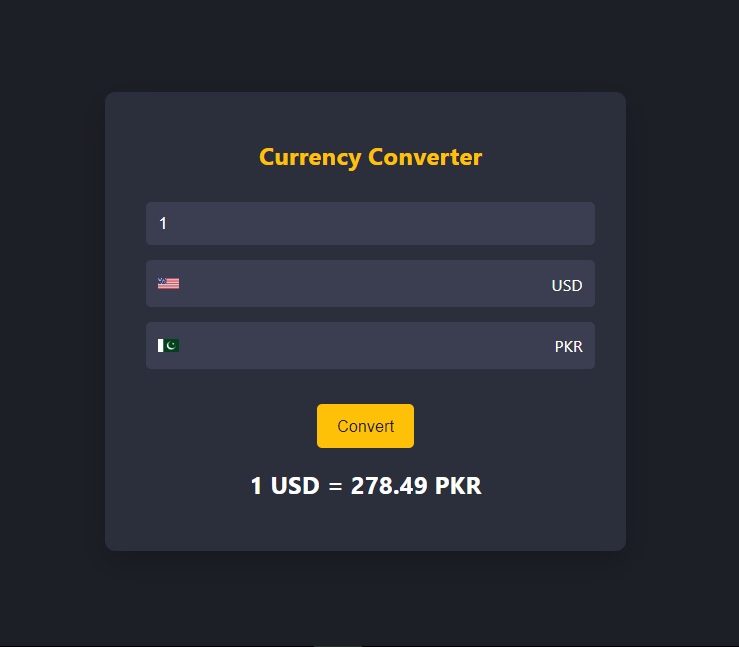

# Currency Converter

A simple web application that allows users to convert between different currencies using real-time exchange rates. This project demonstrates how to build a currency converter using HTML, CSS, and JavaScript with the fetch API for fetching exchange rates.



## Technologies Used

- **HTML**: For structuring the web page.
- **CSS**: For styling the application and creating a responsive design.
- **JavaScript**: For implementing functionality and handling user interactions.
- **Fetch API**: For fetching real-time exchange rates from a public API.

## Features

- Convert between various currencies.
- Fetch real-time exchange rates from a public API.
- Responsive design with a modern UI.
- Interactive and user-friendly interface.

## API Used

The application uses the [ExchangeRate-API](https://www.exchangerate-api.com/) for fetching real-time exchange rates. You can sign up for a free API key on their website if you need one.

### API Endpoint

- **URL**: `https://api.exchangerate-api.com/v4/latest/USD`
- **Method**: GET
- **Description**: Provides exchange rates for various currencies with USD as the base currency.

## Installation

1. Clone the repository:

   ```bash
   git clone https://github.com/Muhammad-Ibrar727/Currency-converter.git
